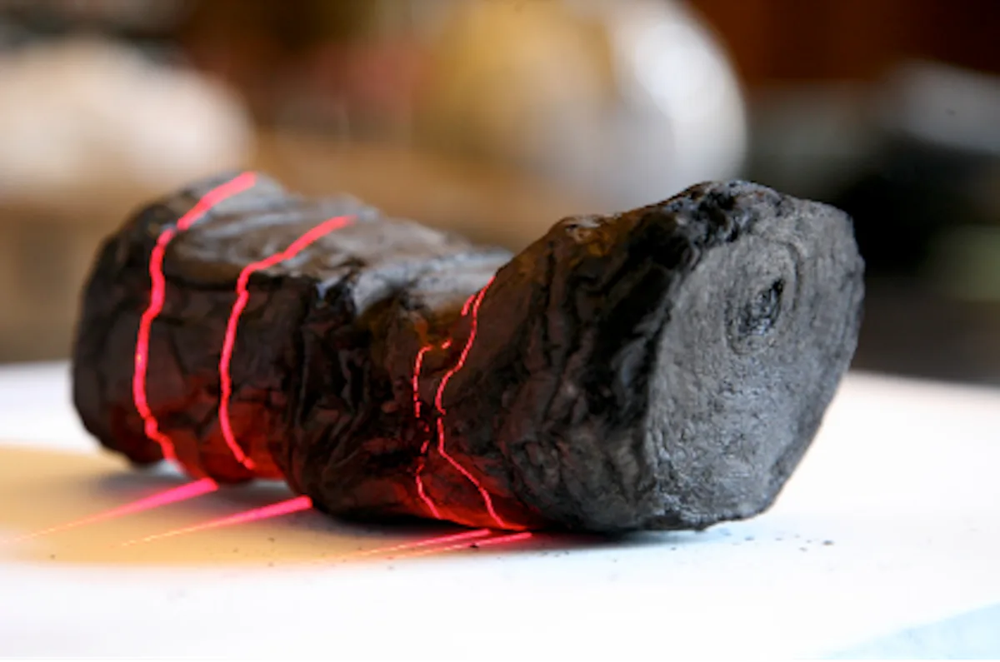
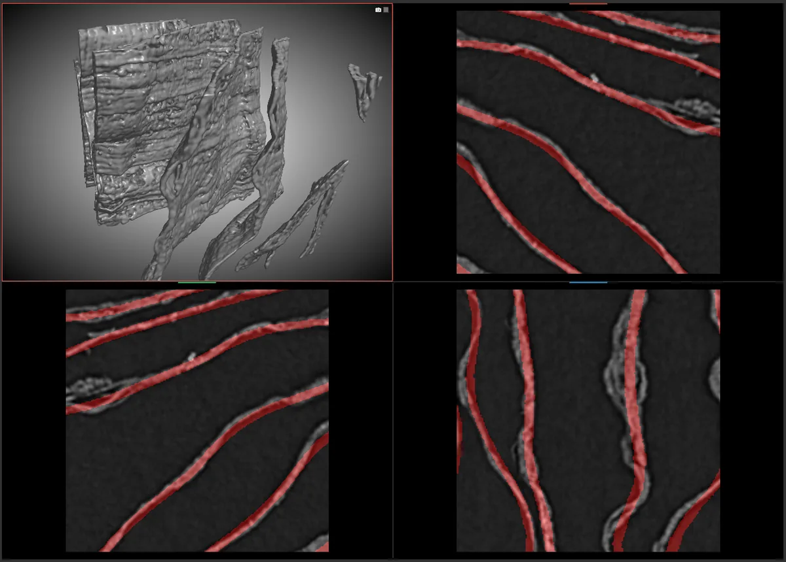

<h1 align="center">Vesuvius Challenge 2025</h1>

<p align="center">Segmenting the <em>recto</em> surface of carbonised Herculaneum papyrus scrolls from 3D X-ray CT volumes.</p>

<p align="center">
  <a target="_blank" href="https://www.linkedin.com/in/myles-dunlap/"></a>
  <a target="_blank" href="https://www.kaggle.com/dunlap0924"></a>
  <a target="_blank" href="https://scholar.google.com/citations?user=ZpHuEy4AAAAJ&hl=en"></a>
</p>

<p align="center">
  🏅 <b>23rd of 1,391 teams — top 1.6%</b> in the
  <a href="https://www.kaggle.com/competitions/vesuvius-challenge-surface-detection">Kaggle Vesuvius Challenge · Surface Detection</a>
</p>

---

<p align="center">
  <b>A complete deep dive into this solution</b> — the data pipeline, architecture, model and loss design,
  training, evaluation and deployment behind the result. Every design decision, explained end to end.
</p>

<p align="center">
  <a href="https://mddunlap924.github.io/vesuvius/"></a>
</p>

---

<p align="center">
  
</p>

Scrolls were scanned without being opened, producing 3D volumes of tightly wound, crushed papyrus sheets.
Before any ink can be detected, the writing surface itself must be located — this repo trains and evaluates
models that segment that surface as a single, topologically correct sheet.

Given a 3D CT sub-volume the model predicts a voxel-wise map: `0` background, `1` recto surface,
`2` unlabelled. The target is a **surface, not a volume** — a couple of voxels thick but hundreds wide — and
**topology matters as much as overlap**: a prediction 99 % correct voxel-wise still scores badly if it closes
a tunnel or bridges two sheets.

<p align="center">
  
</p>

<p align="center"><sub>Scroll imagery: <a href="https://www.kaggle.com/competitions/vesuvius-challenge-surface-detection">Vesuvius Challenge (Kaggle)</a> · <a href="https://aihub.org/2024/09/12/the-vesuvius-challenge-is-using-ai-to-virtually-unroll-pompeiis-ancient-scrolls/">AIhub</a></sub></p>

| Competition term | Weight | Captures |
|---|---|---|
| SurfaceDice | `0.35` | Boundary overlap within a distance tolerance |
| VoiScore | `0.35` | Variation of information vs. ground truth |
| TopoScore | `0.30` | Betti-number matching |

TopoScore is discrete, so nearly every modelling decision here exists to push that term up.

**Two pipelines.** The **custom** approach is a dual-head DynUNet in `src/approach/unetbasic/` (a binary
foreground head plus a tanh-bounded signed-distance head, trained with a topology-aware loss suite); the
**baseline** is nnU-Net v2 in `scripts/nnunetbaseline/`, trained on the same prepared data.

## Quick start

Python ≥ 3.11, a CUDA-capable GPU, and [uv](https://docs.astral.sh/uv/).

```bash
uv sync
cp .env.example .env                       # BASE_DIR, NVME_DIR, device selection
set -a && source .env && set +a

PYTHONPATH=$(pwd)/src uv run python src/approach/unetbasic/train.py --experiment exp_v0
PYTHONPATH=$(pwd)/src uv run python src/approach/unetbasic/inference.py --experiment exp_v0 \
    --checkpoint outputs/unetbasic/exp_v0/results/checkpoint-5000
make test
```

Experiments are layered with Hydra under `src/approach/<approach>/configs/experiments/`.

